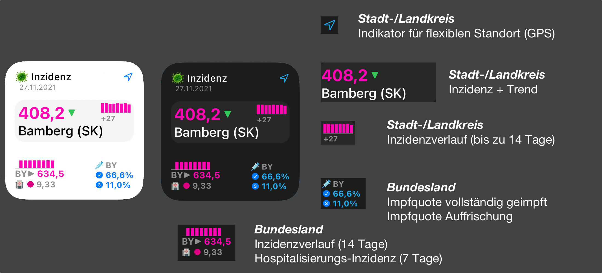
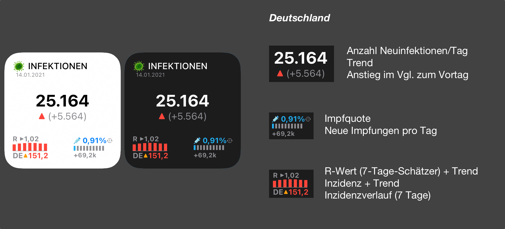
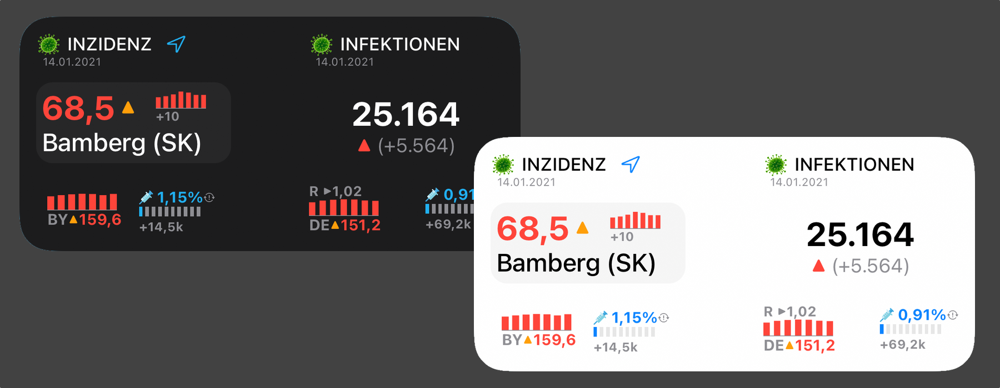
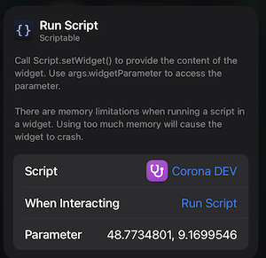

# **Corona Widget für iOS (Scriptable App)**

Das Widget zeigt Daten zu Inzidenz, Neuinfektionen, Impfquoten sowie Hospitalisierungs-Inzidenzen innerhalb Deutschlands an.

Zur einfacheren Organisation und Bereitstellung von Updates befindet sich das Widget-Skript jetzt in diesem Repository, statt wie bisher im GIST. ([Link zum meinem GIST](https://gist.github.com/marcelrebmann/64494e453deaf26cab3c14c9ff711e1e))
 
Zur Nutzung des Widgets wird die kostenlose iOS-App [Scriptable](https://scriptable.app/) benötigt.

☕️ 🤗 Mir einen Kaffee ausgeben: https://ko-fi.com/marsche

<br/>

## **Inzidenz-Modus (Landkreis/Kreisstadt):**  


## **Neuinfektionen-Modus (Deutschland):**  


## **Kombinierter Modus (Medium):**  


<br/>

# Features

### **Inzidenz-Modus (Landkreis/Kreisstadt):**  
* 7-Tages Inzidenz für Landkreis + Bundesland
* Anstieg der absoluten Fallzahlen im Landkreis im Vergleich zum vorherigen Tag
* Hospitalisierungs-Inzidenz + Ampelstufe
* Info zur Aktualität der Daten (RKI)
* Kennzeichnung Kreisfreier Städte (SK)
* Der Landkreis-Name kann durch ein eigenes Label überschrieben werden
* Impfquote für Bundesland (vollständig geimpft + Auffrischung erhalten)
* Auto Light-/Darkmode

<br/>

### **Neuinfektionen-Modus (Deutschland):**  
* Neuinfektionen des vorherigen Tages
* Veränderung der gestrigen Neuinfektionen im Vergleich zum Vortag ("Gestern waren es X Neuinfektionen mehr, als vorgestern")
* 7-Tage-Inzidenz für Deutschland + Trend
* Hospitalisierungs-Inzidenz + Ampelstufe
* Impfquoten für Deutschland (vollständig geimpft + Auffrischung erhalten)
* R-Wert für Deutschland (7-Tage-Schätzwert)
* Auto Light-/Darkmode

<br/>

# Datenquellen
Das Widget basiert auf der offziellen Api des Robert-Koch-Instituts (RKI).
Die Aktualität der bereitgestellten Daten kann aufgrund von Meldeverzögerungen der Gesundheitsämter an das RKI oder anderen technischen Schwierigkeiten abweichen. Die Anzeige im Widget kann ebenfalls einen zeitlichen Verzug aufweisen.

* Daten zu Inzidenzen und Neuinfektionen:  
  https://npgeo-corona-npgeo-de.hub.arcgis.com/

* Daten zu Impfquoten:  
  https://github.com/robert-koch-institut/COVID-19-Impfungen_in_Deutschland

* Daten zum R-Wert:  
  https://github.com/robert-koch-institut/SARS-CoV-2-Nowcasting_und_-R-Schaetzung

* Daten zur Hospitalisierung:  
  https://github.com/robert-koch-institut/COVID-19-Hospitalisierungen_in_Deutschland

Diese Daten werden über ein von mir betriebenes Backend aufbereitet und für das Widget zur Verfügung gestellt.

<br/>

# Installation
1. Das Skript auf dem iOS-Gerät in Safari öffnen: https://raw.githubusercontent.com/marcelrebmann/corona-widget-ios/main/incidence.js
2. Den gesamten Skript-Text markieren und kopieren
3. Die Scriptable-App öffnen und den kopierten Text als neues Skript einfügen oder den Inhalt eines bestehenden ersetzen.
4. Das Scriptable-Widget auf dem Homescreen platzieren und konfigurieren (Siehe Konfiguration)


# Konfiguration
Die Konfiguration findet mittels des WidgetParameters statt.



Der Ort wird mittels Längen- und Breitengrad konfiguriert.  
Tipp: In der Google Maps App einfach einen Standort-Pin mit dem Finger setzen und dann die Kooordinaten kopieren.
Beim Einfügen in die Parameter müssen dann nur noch die Klammern entfernt werden.  
Falls gewünscht, kann als dritter Parameter noch eine eigene Bezeichnung für den Landkreis angegeben werden.

Die WidgetParameter sind wie folgt aufgebaut:  
`{Breitengrad},{Längengrad},{Eigene Landkreis-Bezeichnung (Optional)}`

### **Beispielkonfigurationen:**  

| Beispiele | Konfiguration | Hinweise |
| --------  | ---- | --- |
| Variabler Ort (via Standort/GPS) | - | Erfordert Standortzugriff |
| Fixer Ort | `49.88,12.68` |
| Fixer Ort mit eigener Ortsbezeichnung ("Arbeit") | `49.88,12.68,Arbeit` |
| Neuinfektionen-Modus | `INF` |

<br/>

## Erweiterte Konfiguration
Zur erweiterten Konfiguration können die gesetzten Werte in der `CONFIG`-Variable geändert werden.  

### **Optionen:**  

- `serverUrl`: Adresse, unter der die Serverkomponente erreichbar ist.  
- `showTrendCurves`: Zeichnet Trendlinien in die Charts (experimentell)  
- `debugMode`: Aktiviert detailliertere Logs zur Fehlerbehebung  
- `fontScaleFactor`: Skaliert die Schriftgrößen um den angegebenen Faktor  
- `fontSize`: Definiert die Schriftgrößen  
- `chartWidth`: Definiert die Breite der angezeigten Diagramme

# Legende

## Inzidenz

| Farbe | Inzidenz |
| --- | --- |
| GRÜN | < 35 |  
| ORANGE | >= 35 |
| ROT | >= 50 |
| MAGENTA | >= 100 |
| PINK | >= 200 |

<br/>

## Trendpfeile

| Symbol | Farbe | Bedeutung |
| --- | --- | --- |
| ▼ | GRÜN | Fallende Inzidenz |  
| ▶︎ | GRAU | Gleichbleibende Inzidenz |
| ▲ | ORANGE | Leicht ansteigende Inzidenz |
| ▲ | ROT | Stark ansteigende Inzidenz |

<br/>

## Hospitalisierungs-Inzidenz
| Inzidenzstufe | Farbe |
| --- | --- |
| < 3 | Grün |
| >= 3 | Gelb |
| >= 6 | Rot |
| >= 9 | Magenta |

<br/>

# Hinweise zu Störungen

Bei technischen Problemen des RKI können möglicherweise keine/veraltete Daten im Widget angezeigt werden.

**Wichtig:**  
Die Konfiguration mit variablem Ort (per GPS) setzt einen regelmäßigen Abgleich mit der RKI-Schnittstelle voraus, um den Landkreis zu ermitteln, in dem man sich gerade befindet.  
Falls die RKI-Schnittstelle zeitweise nicht verfügbar oder überlastet ist, werden keine Daten angezeigt.

Die Konfigurationen mit fixem Ort sowie der Neuinfektionen-Modus werden bei einer technischen Störung in der Regel ältere Daten angezeigt (erkennbar am Zeitstempel im Widget).

<br/>

# Self-Hosted Server (optional)
Wer möchte, kann die Serverkomponente ebenfalls auf einem eigenen Server/Rechner betrieben, um die Daten des RKI für das Widget aufzubereiten.
Zur Installation werden `Node.js` (Version >=14.x) und `npm` benötigt.

### **Installation**

1. **Source Code Downloaden und entpacken**  
  `server_v1.x.zip` auf dem Zielserver entpacken. Alternativ entpacken auf dem lokalen Rechner und den source code anschließend auf den Zielserver kopieren.

2. **Dependencies installieren**  
`npm install` im Zielordner ausführen 

3. **Server starten**  
Der Server kann direkt via Node.js `node ./server.js` gestartet werden.  
Es empfiehlt sich jedoch den Server als Service zu konfigurieren, der bspw bei einem Neustart automatisch wieder startet.

__Systemd Service File Template:__

```
[Unit]
Description=Corona Server

[Service]
Type=simple
ExecStart=/path/to/node/ /path/to/corona-server/dist/server.js
Restart=always
RestartSec=5
Environment=NODE_ENV=production

[Install]
WantedBy=multi-user.target
```

4. **Anpassen der Server URL im Skript**  
Die URL des selbst gehosteten Servers muss nun im Skript in `CONFIG.serverUrl` eingetragen werden.

<br/>

# Contributing
Bei Verbesserungsvorschlägen/Bugs/etc gerne einen PR stellen oder ein Issue öffnen!

<br/>

# Changelog

## Version 1.4.2
- Verbessert das Laden der Cache-Dateien

## Version 1.4.1
- Behebt einen Fehler beim Datenabruf des INF-Mode

## Version 1.4.0
- Unterstützung der Widget-Größen Large and Extralarge (XXL)
- Schriftgrößen für kleinere Gerätegrößen optimiert

## Version 1.3.1
- Behebt einen Fehler, bei dem das Impf-Image nicht korrekt geladen werden konnte. 

## Version 1.3.0
- RKI GitHub-Repo als Datenquelle hinzugefügt
- Hospitalisierungs-Inzidenz
- Impfquoten für vollständig geimpft & Booster-Impfungen
- Layout-Verbesserungen
- Daten werden nun auch im Offline-Modus angezeigt (zuletzt bekannte Daten)

## Version 1.2.3
- Minor fix for rki vaccination reports

## Version 1.2.1
- Inzidenz-Stabilitätslevel "100-200" und "über 200" (Hotspot) hinzugefügt
- Flexible Anpassung der Schriftgrößen einzeln oder per Skalierungsfaktor hinzugefügt
- Flebible Anpassung der Diagramm-Breiten hinzugefügt
- [Server] Anpassung an aktuelles Format des RKI Impfquoten Report

## Version 1.2.0
- Erweiterung der Inzidenzwert-Historien auf die vergangenen 2 Wochen (14 Tage)
- Aktuelles Stabilitäts-Level für Landkreis-Inzidenz hinzugefügt. ("Einzelhandels-Ampel")
- Veröffentlichung des Server source codes mit Option zum selbst hosten
- 100er Grenzwert für Inzidenz hinzugefügt

## Version 1.1.2
- Behebt ein Problem, bei dem die Standortermittlung bei einer frischen Installation fehlschlagen konnte

## Version 1.1.1
- Behebt ein Problem im kombinierten Modus, bei dem Inzidenzen nicht vollständig angezeigt wurden
- Verbessert die Abfrage-Effizienz des Inzidenz-Modus Widgets
- Konsistente Formatierung von Kommazahlen abhängig von der Lokalisierung des Geräts

## Version 1.1.0
- Neues Design
- R-Wert (7-Tage-Schätzwert) für Bundesland und Deutschland + Trend
- Balkendiagramme für Inzidenzverläufe
- Fortschrittsbalken-Grafik für Impfquoten

## Version 1.0.0
- Inzidenzen + Trends
- Neuinfektionen Kreis + DE
- Impfquote Bundesland + DE
- Kombinierter Modus (Medium-Größe)
- Farbige Grenzwerte: < 35, 35, 50, 200
- Lokales Datencaching
