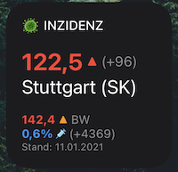
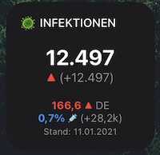
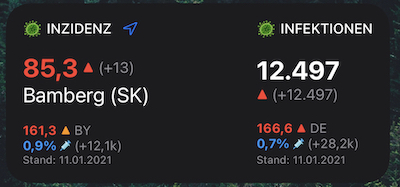

# **Corona Widget für iOS (Scriptable App)**

Das Widget zeigt Daten zur Inzidenz, Neuinfektionen sowie Impfungen innerhalb Deutschlands an.

Zur einfacheren Organisation und Bereitstellung von Updates befindet sich das Widget-Skript jetzt in diesem Repository, statt wie bisher im GIST. ([Link zum meinem GIST](https://gist.github.com/marcelrebmann/64494e453deaf26cab3c14c9ff711e1e))

**Wichtig:**  
Zur Nutzung des Widgets wird die kostenlose iOS-App [Scriptable](https://scriptable.app/) benötigt.

☕️ 🤗 Mir einen Kaffee ausgeben: https://ko-fi.com/marsche

 

# Screenshots

### **Inzidenz-Modus (Landkreis/Kreisstadt):**  

### **Neuinfektionen-Modus (Deutschland):**  

### **Kombinierter Modus (Medium):**  

 

# Features

### **Inzidenz-Modus (Landkreis/Kreisstadt):**  
* 7-Tages Inzidenz für Landkreis + Bundesland
* Anstieg der absoluten Fallzahlen im Landkreis im Vergleich zum vorherigen Tag
* Info zur Aktualität der Daten (RKI)
* Kennzeichnung Kreisfreier Städte (SK)
* Der Landkreis-Name kann durch ein eigenes Label überschrieben werden
* Impfquote für Bundesland und Anstieg der Impfungen im Vergleich zum Vortag

 

### **Neuinfektionen-Modus (Deutschland):**  
* Neuinfektionen des vorherigen Tages
* Veränderung der gestrigen Neuinfektionen im Vergleich zum Vortag ("Gestern waren es X Neuinfektionen mehr, als vorgestern")
* 7-Tage-Inzidenz für Deutschland + Trend
* Impfquoten für Deutschland und Anstieg der Impfungen im Vergleich zum Vortag

 

# Datenquellen
Das Widget basiert auf der offziellen Api des Robert-Koch-Instituts (RKI).
Die Aktualität der bereitgestellten Daten kann aufgrund von Meldeverzögerungen der Gesundheitsämter an das RKI oder anderen technischen Schwierigkeiten abweichen. Die Anzeige im Widget kann ebenfalls einen zeitlichen Verzug aufweisen.

* Daten zu Inzidenzen und Neuinfektionen:  
  https://npgeo-corona-npgeo-de.hub.arcgis.com/

* Daten zu Impfquoten:  
  https://www.rki.de/DE/Content/InfAZ/N/Neuartiges_Coronavirus/Daten/Impfquoten-Tab.html

Diese Daten werden über ein von mir betriebenes Backend aufbereitet und für das Widget zur Verfügung gestellt.

 

# Installation
1. Das Skript auf dem iOS-Gerät in Safari öffnen: https://raw.githubusercontent.com/marcelrebmann/corona-widget-ios/main/incidence.js
2. Den gesamten Skript-Text markieren und kopieren
3. Die Scriptable-App öffnen und den kopierten Text als neues Skript einfügen oder den Inhalt eines bestehenden ersetzen.
4. Das Scriptable-Widget auf dem Homescreen platzieren und konfigurieren (Siehe Konfiguration)

# Konfiguration
Die Konfiguration findet mittels des WidgetParameters statt.

)

Der Ort wird mittels Längen- und Breitengrad konfiguriert.
Falls gewünscht, kann als dritter Parameter noch eine eigene Bezeichnung für den Landkreis angegeben werden.

Die WidgetParameter sind wie folgt aufgebaut:  
`{Breitengrad},{Längengrad},{Eigene Landkreis-Bezeichnung (Optional)}`

### **Beispielkonfigurationen:**  

| Beispiele | Konfiguration |
| --------  | ---- |
| Variabler Ort (via Standort/GPS) | - |
| Fixer Ort | `49.88,12.68` |
| Fixer Ort mit selbstgewählter Ortsbezeichnung ("Arbeit") | `49.88,12.68,Arbeit` |
| Neuinfektionen-Modus | `INF` |

 

# Legende

## Inzidenz

| Farbe | Inzidenz |
| --- | --- |
| GRÜN | < 35 |  
| GELB | > 35 |
| ROT | > 50 |
| MAGENTA | > 200 |

 

## Trendpfeile

| Symbol | Farbe | Bedeutung |
| --- | --- | --- |
| ▼ | GRÜN | Fallende Inzidenz |  
| ▶︎ | GRAU | Gleichbleibende Inzidenz |
| ▲ | ORANGE | Leicht ansteigende Inzidenz |
| ▲ | ROT | Stark ansteigende Inzident |

 

# Changelog

#### **Update 11.01.2021**
Impfquoten für Bundesländer und Deutschland werden angezeigt (Datenquelle: RKI).
- Prozentuale Anzeige der Impfungen im jeweiligen Bundesland bzw. in Deutschland (INF-Modus)
- Zunahme im Vergleich zum Vortag
- Indikator (Ausrufezeichen mit Pfeil) zur Info, falls nur "veraltete" Impfdaten zur Verfügung stehen (Die Daten werden vom RKI nur werktags aktualisiert).

#### **Update 28.12.2020**
Behebt ein Problem, bei dem gelegentlich (oftmals morgens) keine Daten angezeigt wurden - vermutlich aufgrund starker Auslastung der RKI API.

- Caching der zuletzt abgefragten Daten lokal auf dem Gerät. Falls keine Daten geladen werden können, werden diese angezeigt.
- Verbesserung der Effizienz durch weniger Aktualisierungen im Hintergrund.

#### **Update 08.12.2020**
- Neue Farbe (dunkles Magenta) bei Inzidenzen über dem 200er Grenzwert.
- Die Medium-Größe des Scriptable Widgets wird nun auch unterstützt.

#### **Update 07.11.2020**
 - Das Infektionen (INF) Widget kann wahlweise zentriert oder linksbündig angezeigt werden.
  Einstellbar über die Konfigurations-Variable `CONFIG.isInfectionsWidgetCentered`
- Die Hintergrundfarbe im Dark Mode ist jetzt nicht mehr komplett schwarz, sondern gleicht der anderer Apple-Widgets (beispielsweise dem Kalender-Widget)
- Stadtkreise werden nun mit `(SK)` annotiert, um mehr Platz zu schaffen.

#### **Update 24.10.2020 - Trends sind jetzt verfügbar!**
Die Trends basieren auf dem Verlauf der jeweiligen Inzidenzwerte der letzten 7 Tage für den ausgewählten Stand-/Landkreis/Bundesland/Deutschland
**Symbollegende:**
- ▲ = steigend (Farben: ROT = starker Anstieg, ORANGE = moderater Anstieg)
- ▶︎ = gleichbleibend (Farbe: GRAU)
- ▼ = fallend (Farbe: GRÜN)