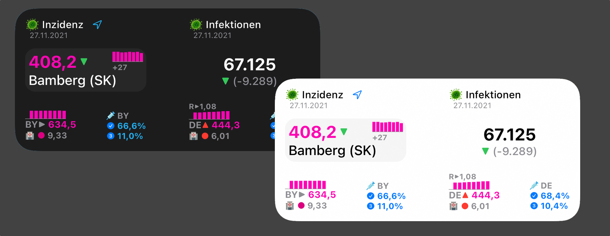

# **Corona Widget für iOS (Scriptable App)**

Das Widget zeigt Daten zur Inzidenz, Neuinfektionen sowie Impfungen innerhalb Deutschlands an.

Zur einfacheren Organisation und Bereitstellung von Updates befindet sich das Widget-Skript jetzt in diesem Repository, statt wie bisher im GIST. ([Link zum meinem GIST](https://gist.github.com/marcelrebmann/64494e453deaf26cab3c14c9ff711e1e))
 
Zur Nutzung des Widgets wird die kostenlose iOS-App [Scriptable](https://scriptable.app/) benötigt.

☕️ 🤗 Mir einen Kaffee ausgeben: https://ko-fi.com/marsche

 

## **Inzidenz-Modus (Landkreis/Kreisstadt):**  

## **Neuinfektionen-Modus (Deutschland):**  

## **Kombinierter Modus (Medium):**  

 

# Features

### **Inzidenz-Modus (Landkreis/Kreisstadt):**  
* 7-Tages Inzidenz für Landkreis + Bundesland
* Anstieg der absoluten Fallzahlen im Landkreis im Vergleich zum vorherigen Tag
* Info zur Aktualität der Daten (RKI)
* Kennzeichnung Kreisfreier Städte (SK)
* Der Landkreis-Name kann durch ein eigenes Label überschrieben werden
* Impfquote für Bundesland und Anstieg der Impfungen im Vergleich zum Vortag
* R-Wert für Bundesland (7-Tage-Schätzwert)
* Auto Light-/Darkmode

 

### **Neuinfektionen-Modus (Deutschland):**  
* Neuinfektionen des vorherigen Tages
* Veränderung der gestrigen Neuinfektionen im Vergleich zum Vortag ("Gestern waren es X Neuinfektionen mehr, als vorgestern")
* 7-Tage-Inzidenz für Deutschland + Trend
* Impfquoten für Deutschland und Anstieg der Impfungen im Vergleich zum Vortag
* R-Wert für Deutschland (7-Tage-Schätzwert)
* Auto Light-/Darkmode

 

# Datenquellen
Das Widget basiert auf der offziellen Api des Robert-Koch-Instituts (RKI).
Die Aktualität der bereitgestellten Daten kann aufgrund von Meldeverzögerungen der Gesundheitsämter an das RKI oder anderen technischen Schwierigkeiten abweichen. Die Anzeige im Widget kann ebenfalls einen zeitlichen Verzug aufweisen.

* Daten zu Inzidenzen und Neuinfektionen:  
  https://npgeo-corona-npgeo-de.hub.arcgis.com/

* Daten zu Impfquoten:  
  https://www.rki.de/DE/Content/InfAZ/N/Neuartiges_Coronavirus/Daten/Impfquoten-Tab.html

* Daten zum R-Wert:  
  https://www.rki.de/DE/Content/InfAZ/N/Neuartiges_Coronavirus/Projekte_RKI/Nowcasting.html

Diese Daten werden über ein von mir betriebenes Backend aufbereitet und für das Widget zur Verfügung gestellt.

 

# Installation
1. Das Skript auf dem iOS-Gerät in Safari öffnen: https://raw.githubusercontent.com/marcelrebmann/corona-widget-ios/main/incidence.js
2. Den gesamten Skript-Text markieren und kopieren
3. Die Scriptable-App öffnen und den kopierten Text als neues Skript einfügen oder den Inhalt eines bestehenden ersetzen.
4. Das Scriptable-Widget auf dem Homescreen platzieren und konfigurieren (Siehe Konfiguration)

# Konfiguration
Die Konfiguration findet mittels des WidgetParameters statt.

)

Der Ort wird mittels Längen- und Breitengrad konfiguriert.
Falls gewünscht, kann als dritter Parameter noch eine eigene Bezeichnung für den Landkreis angegeben werden.

Die WidgetParameter sind wie folgt aufgebaut:  
`{Breitengrad},{Längengrad},{Eigene Landkreis-Bezeichnung (Optional)}`

### **Beispielkonfigurationen:**  

| Beispiele | Konfiguration | Hinweise |
| --------  | ---- | --- |
| Variabler Ort (via Standort/GPS) | - | Erfordert Standortzugriff |
| Fixer Ort | `49.88,12.68` |
| Fixer Ort mit eigener Ortsbezeichnung ("Arbeit") | `49.88,12.68,Arbeit` |
| Neuinfektionen-Modus | `INF` |

 

# Legende

## Inzidenz

| Farbe | Inzidenz |
| --- | --- |
| GRÜN | < 35 |  
| GELB | >= 35 |
| ROT | >= 50 |
| MAGENTA | >= 200 |

 

## Trendpfeile

| Symbol | Farbe | Bedeutung |
| --- | --- | --- |
| ▼ | GRÜN | Fallende Inzidenz |  
| ▶︎ | GRAU | Gleichbleibende Inzidenz |
| ▲ | ORANGE | Leicht ansteigende Inzidenz |
| ▲ | ROT | Stark ansteigende Inzidenz |

 

# Hinweise zu Störungen

Bei technischen Problemen des RKI können möglicherweise keine/veraltete Daten im Widget angezeigt werden.

**Wichtig:**  
Die Konfiguration mit variablem Ort (per GPS) setzt einen regelmäßigen Abgleich mit der RKI-Schnittstelle voraus, um den Landkreis zu ermitteln, in dem man sich gerade befindet.  
Falls die RKI-Schnittstelle zeitweise nicht verfügbar oder überlastet ist, werden keine Daten angezeigt.

Die Konfigurationen mit fixem Ort sowie der Neuinfektionen-Modus werden bei einer technischen Störung in der Regel ältere Daten angezeigt (erkennbar am Zeitstempel im Widget).

# Contributing
Bei Verbesserungsvorschlägen/Bugs/etc gerne einen PR stellen oder ein Issue öffnen!

# Changelog

## Version 1.1.0
- Neues Design
- R-Wert (7-Tage-Schätzwert) für Bundesland und Deutschland + Trend
- Balkendiagramme für Inzidenzverläufe
- Fortschrittsbalken-Grafik für Impfquoten

## Version 1.0.0
- Inzidenzen + Trends
- Neuinfektionen Kreis + DE
- Impfquote Bundesland + DE
- Kombinierter Modus (Medium-Größe)
- Farbige Grenzwerte: < 35, 35, 50, 200
- Lokales Datencaching
